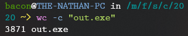
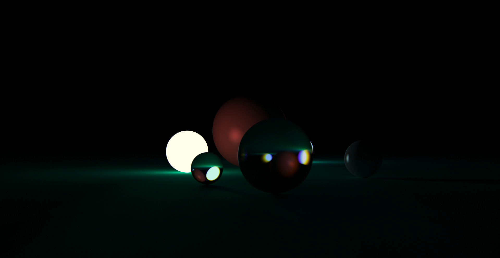

# first-4kb-demo
first attempt at a 4kb demo with raytracing (dec 2020)

Running
---

You will need [crinkler](https://github.com/runestubbe/Crinkler) and Visual C++ to compile this, along with the [glext.h](https://www.khronos.org/registry/OpenGL/api/GL/glext.h) and [khrplatform.h](https://www.khronos.org/registry/EGL/api/KHR/khrplatform.h) header files in the same folder.

To compile to get a 3.8kB executable file (on Windows), run the following commands.

```
cl raytrace.c /c /Os /Gr /Gs /Oi /QIfist
crinkler.exe /subsystem:windows /tinyimport /compmode:slow raytrace.obj kernel32.lib user32.lib gdi32.lib opengl32.lib glu32.lib msvcrt.lib
```

Then you can run `out.exe` and see some raytraced goodness.

The filesize should be under 4kb.



What you should see
---


